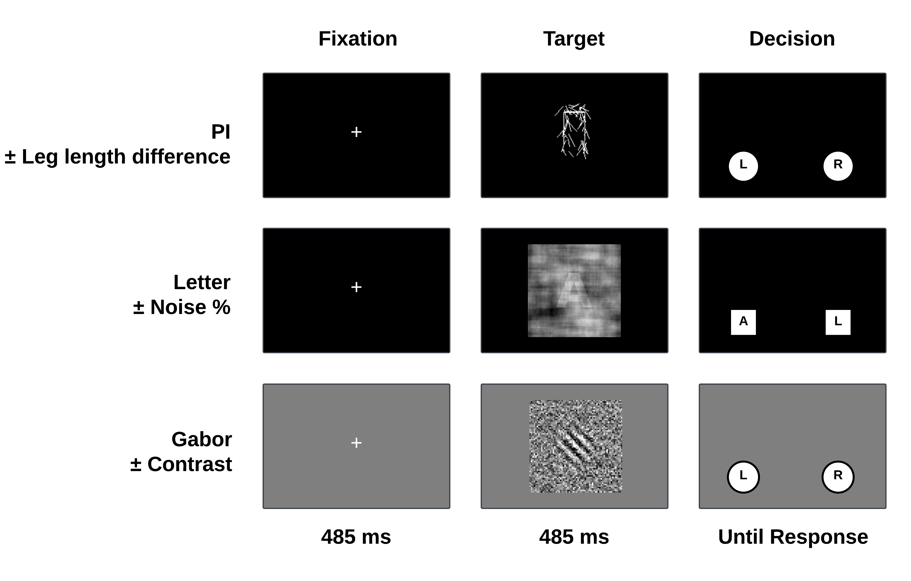
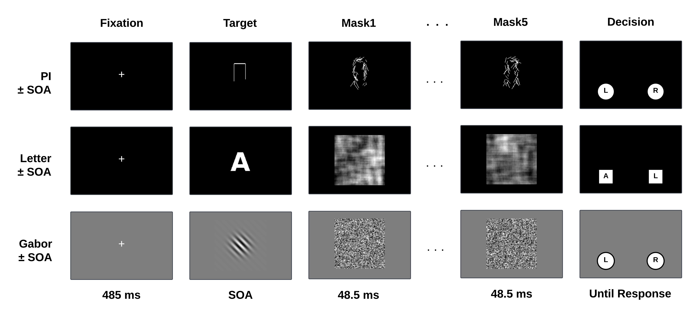

```{r}
knitr::opts_chunk$set(
  echo = FALSE, 
  message=FALSE, 
  warning = FALSE)
```


```{r Spatial, echo = FALSE, fig.cap = "Spatial visual masking tasks.", out.width = "100%"}

```

```{r Temporal, echo = FALSE, fig.cap = "Temporal visual masking tasks.", out.width = "100%"}

```

# Sensory discrimination, processing speed, and intelligence.

Understanding how different cognitive abilities interrelate and contribute to intelligence has long been a central objective of cognitive psychology and individual-differences research. In the late 19th century, Galton [@Galton.1883] hypothesized that individual differences originate from basic sensory discrimination, proposing that sharper perceptual acuity leads to better performance in cognitive tasks involving judgement and intelligence. He believed that these cognitive tasks can be best measured by a variety of simple tests of sensory discrimination [@Jensen.1998].

Early empirical attempts to test this hypothesis, however, yielded little support. For example, Wissler [@Wissler.1901] reported negligible correlations between elementary sensory tasks and academic performance, and subsequent studies typically found only weak associations, often in the range of 0 to 0.3 [@Thorndike.Dean.1909; @Acton.Schroeder.2001; @Li.etal.1998]. With the advancement of statistical methods, particularly the development of correlation techniques and Spearman’s pioneering use of factor analysis, Spearman [@Spearman.1904] demonstrated that a wide variety of cognitive tasks—including, but not restricted to, sensory discrimination—are positively correlated. He explained this pervasive “positive manifold” by positing a latent general intelligence factor (g). This framework shifted Galton's interpretation: rather than viewing sensory discrimination as the root of intelligence, it became one of many domains reflecting the influence of g.

Why are correlations between sensory discrimination and intelligence relatively small? One explanation is that sensory discrimination is not the root, or only part of the cause of intelligence. Another explanation, as Deary [@Deary.1994] argued, is that early attempts to link intelligence with the senses were undermined by methodological shortcomings, including reliance on poorly conducted negative studies, inadequate control of trial noise, and insufficient sampling of individual differences.For example, Deary argued that Wissler’s finding of a negligible correlation was problematic, since the individual variation in his data was too limited. More recent research has reported stronger associations when examined at the latent-variable level. For instance, Deary and colleagues [@Deary.etal.2004] administered a broad battery of basic sensory judgments—such as pitch, brightness, and line length. He found that a latent factor capturing sensory discrimination correlated substantially (r $\approx$ .92) with a general intelligence factor. He also re-analysed Acton and Schroeder's early data and found a latent correlation r $\approx$ .68 between general intelligence and general sensory ability. Extending this line of work, Meyer and colleagues [@Meyer.etal.2010] reported a similarly strong latent correlation (r $\approx$ .78) in children. It is important to emphasize, however, that latent correlations can appear inflated because they statistically remove measurement error. Once variance attributable to noise is eliminated, the underlying shared variance between constructs is magnified. In summary, while some evidence points to a stronger link at the latent level, the overall relationship between sensory discrimination and intelligence remains equivocal.

By contrast, research on processing speed has yielded more consistent associations with intelligence. Processing speed is thought to index the efficiency of neural information transmission, which may form a biological basis of general ability (see [@Jensen.2006; @Vernon.1983] for reviews). A widely used measure of processing speed is the inspection time, the minimum exposure duration required to reliably discriminate simple stimuli [@Vickers.Smith.1986a]. For example, Nettelbeck and Lally [@Nettelbeck.Lally.1976a] reported a Spearman correlation of –0.9 between visual inspection time and performance IQ in a small sample, while Deary and Stough [@Deary.1995] observed a more moderate correlation of about –0.4 between auditory inspection time and intelligence. Meta-analytic reviews converge on an average corrected correlation of r $\approx$ –0.5, and an uncorrected correlation of r $\approx$ –0.3 [@Grudnik.Kranzler.2001; @Kranzler.Jensen.1989a]. These findings suggest that processing speed, as indexed by inspection time, is more robustly associated with general intelligence than elementary sensory discrimination.

# Spatial and temporal visual masking

Visual masking refers to the reduction or elimination of stimulus visibility when a briefly presented target is followed or accompanied by another visual pattern, the mask. It is a widely used paradigm to investigate the spatial properties [@Enns.DiLollo.2000] or temporal dynamics [Breitmeyer.Ogmen.2006] of visual perception. Two commonly studied types are spatial masking and temporal backward masking. The critical difference lies in the relative timing of mask presentation: in spatial masking, the mask overlaps spatially with the target and is presented simultaneously, whereas in temporal backward masking the mask follows the target after a short stimulus–onset asynchrony (SOA).

Although both procedures can strongly reduce target visibility, they are thought to rely on partly different underlying mechanisms. Spatial masking is often attributed to processes of sensory interference and lateral inhibition within early visual cortex, where the target must be distinguished from concurrently presented structured noise [@Enns.DiLollo.2000]. In contrast, backward masking is believed to reflect limitations of temporal information transfer and reentrant processing: the target representation must reach higher cortical levels before it is disrupted or overwritten by the subsequent mask [@Lamme.Roelfsema.2000].

Building on these distinctions, we propose to use spatial and temporal masking to assess the contributions of sensory discrimination ability and processing speed to individual differences in intelligence. Specifically, spatial masking performance may index one’s capacity to extract relevant signal from spatially overlapping noise, whereas backward masking performance may index the efficiency with which visual information is transmitted and consolidated before being lost. A key advantage of our design is that we use the same target stimuli and the same masks across both masking procedures. This ensures strict control of experimental variables, such that any observed differences can be attributed to the manipulation of temporal dynamics rather than stimulus properties. Consequently, this approach allows us to examine whether sensory discrimination and processing speed make independent contributions to intelligence, whether only processing speed is critical, or whether both reflect a shared underlying mechanism.

# Role of working memory

Although visual masking provides a promising approach to investigate the present research question, its results may also be influenced by another key explanatory construct—working memory (WM). According to Jastrzebski and colleagues [@Jastrzebski.etal.2021], WM likely constitutes a central bottleneck common to many sensorimotor tasks, because stimuli must be represented mentally in order to be compared, and task performance depends on the fidelity of such internal representations. In their sensorimotor battery, they found that WM fully accounted for the shared variance among sensory discrimination tasks as well as their associations with intelligence. Similar conclusions were drawn by Voelke and colleagues [@Voelke.etal.2014], who demonstrated that WM fully mediated the relationship between sensory discrimination and fluid intelligence.

A similar mediating role of working memory has also been proposed in the relationship between processing speed and intelligence. Fry and Hale [@Fry.Hale.1996] showed that individual differences in processing speed predicted fluid intelligence primarily through their influence on working memory capacity. Consistent with this, Kail and Salthouse [@Kail.Salthouse.1994] reviewed evidence indicating that faster processing allows for the maintenance and manipulation of more information within working memory before it decays, thereby enhancing complex reasoning. More recent work has supported this view by demonstrating that working memory partially or fully mediates the association between processing speed and higher-order cognitive abilities [@Oberauer.2019a]. These findings suggest that working memory may constitute a common pathway through which both sensory discrimination and processing speed exert their effects on intelligence.

# Position of our study

The present study aims to clarify the interplay among sensory discrimination, processing speed, working memory, and intelligence. Our contribution is threefold.

First, we employ both visual spatial masking and temporal backward masking to obtain separate indices of sensory discrimination and processing speed. A critical advantage of our design is that the same target stimuli and masks are used across both paradigms, thereby ensuring strict experimental control and eliminating potential confounds due to stimulus properties. Any observed differences can thus be attributed specifically to temporal dynamics rather than stimulus characteristics. In addition, we employ three different stimulus–mask combinations—Gabor targets with white-noise masks, letter stimuli with frequency masks, and $\Pi$-shaped targets [@Eisma.deWinter.2020] with pattern masks—to examine whether different masking conditions make distinct contributions to intelligence or whether they reflect shared variance across tasks. Second, we advance the methodological approach by applying hierarchical Bayesian modeling [@Rouder.2025]. At the trial level, we fit full psychometric functions, which allows us to explicitly account for trial noise and obtain more precise estimates of individual performance. At the construct level, we will aggregate across tasks and conduct factor analyses at the latent-variable level, thereby providing more stable and robust representations of each cognitive domain. Third, the study benefits from a large-scale design. Each construct—sensory discrimination, processing speed, and working memory—will be assessed with three independent tasks. This multi-indicator approach enables reliable estimation of latent factors and a rigorous test of their interrelations with intelligence.

Taken together, this design allows us to address several key questions: 1) Do sensory discrimination and processing speed constitute fundamental sources of individual differences in intelligence? 2) If so, do they explain overlapping variance or independent components of intelligence? 3) What is the role of working memory—does it partially or fully mediate the contributions of sensory discrimination and processing speed? 4) Through this combination of experimental control, modeling technique, and large-scale measurement, our study seeks to provide a more definitive account of how basic perceptual and cognitive processes contribute to human intelligence, and how uncertainty the results are.

# Experimental Method 

## Apparatus

Individuals ran in a dimly lit cubicle.  They sat approximately 100 cm from the display, which was a 24-inch LED BENQ gaming monitor.  The display was driven by a PC running Lubuntu Linux (22.04).  Displays were generated in PsychoPy3 libraries in Python (3.8).  The display resolution was 1920 $\times$ 1080 pixels and refreshed with a rate of 165 Hz (6.06 ms/frame).  Background illumination on the screen was a middle gray at $\approx$ 100 cd/m$^2$.

## Tasks overview

To assess the general discrimination ability and processing speed, the experiment contained six visual masking tasks: three employing spatial masking \ref{fig:Spatial} and three employing temporal masking \ref{fig:Temporal}. Both sets of tasks used the same stimulus classes (a Gabor stimulus, a letter stimulus, and a Pi stimulus) along with the masks and task requirements. The only difference was the masking procedure: in the spatial masking tasks, the stimulus and mask were presented simultaneously, whereas in the temporal masking tasks the mask followed the stimulus after a variable stimulus–onset asynchrony (SOA). This design ensured stricter control of experimental variables, preventing any potential confounds other than the spatial–temporal manipulation from influencing the results. Each task began with 25 practice trials at higher visibility, during which accuracy feedback was provided. The main experimental phase then followed without feedback. For all six tasks, stimulus contrast was adaptively controlled using a two-down-one-up (2D1U) staircase procedure, which adjusted task difficulty based on participants’ performance and converged to approximately 70.7% accuracy. Each task comprised eight blocks of 25 trials (200 trials in total). From the second block onward, the initial contrast level was set to the final contrast level obtained at the end of the preceding block, allowing task difficulty to adapt across blocks.

To assess the working memory, the experiment contained three working memory tasks: Operational Span (OSPAN), Counting Span (CSPAN), and Spatial (SPAN).

To assess the intelligence, the experiment used a single matrix reasoning task called University of California Matrix Reasoning Task (UCMRT).

## Spatial Masking Tasks

**Gabor.**$\quad$Participants completed a two-alternative forced-choice orientation discrimination task. On each trial, a fixation cross was presented for 485 ms, followed by a centrally presented, random-phase Gabor patch (±45° orientation) embedded in white noise, which remained on the screen for another 485 ms. Participants indicated whether the grating was tilted up-left or up-right by pressing the keyboard. Task difficulty was adaptively adjusted by varying stimulus contrast.

**Letter.**$\quad$Participants performed a forced-choice letter identification task using the keys A–L (second keyboard row). Each trial began with a 485 ms fixation cross, followed by a centrally presented target letter (one of A, S, D, F, G, H, J, K, L) displayed for  485 ms. The letter was embedded in a frequency-matched letter noise mask constructed as follows: We constructed the mask by first computing the pixelwise average of the nine possible letters and then perturbing its Fourier spectrum with complex Gaussian noise. After inverse transformation and normalization, this yielded a structured noise pattern with the same overall spatial frequency profile as the average letter image. On each trial, the target letter was linearly blended with this mask (blend coefficient $\alpha$), and participants identified the letter using the corresponding keyboard key. Task difficulty was adaptively adjusted by varying $\alpha$.

**Pi.**$\quad$Participants performed a forced-choice judgment on a $\Pi$-shaped (Pi) target, indicating which vertical “leg” was longer (left vs. right). Each trial began with a 485 ms fixation cross, followed by a centrally presented $\Pi$ stimulus for  485 ms. The mask was composed of random oblique line segments arranged to form a $\Pi$-like clutter. Short line elements (randomized in length and orientation within ±10°–45°) were placed in two vertical columns aligned with the legs of the $\Pi$ and around the crossbar region. Equal numbers of lines were drawn on each side, although their random placement could introduce local asymmetries. On each trial, the target $\Pi$ was superimposed on this cluttered mask, and participants indicated which leg appeared longer using the keyboard. Task difficulty was adaptively controlled by varying the leg-length difference ($\Delta L$).

## Temporal Masking Tasks

**Gabor.**$\quad$The task matched the spatial Gabor-orientation discrimination task. Each trial began with a 485 ms fixation cross, followed by a centrally presented, random-phase Gabor patch (±45° orientation) embedded in white noise. After a variable SOA, the target was replaced by a dynamic sequence of five white noise masks (48 ms each). Participants indicated whether the grating was tilted up-left or up-right by pressing the keyboard. Task difficulty was adaptively adjusted by SOA.

**Letter.**$\quad$The task matched the spatial letter-identification condition. Each trial began with a 485 ms fixation cross, followed by a centrally presented target letter (one of A, S, D, F, G, H, J, K, L). After a variable SOA, the target was replaced by a dynamic sequence of five frequency-matched letter noise masks (48 ms each). Participants identified the letter using the corresponding keyboard key. Task difficulty was adaptively adjusted by varying SOA.

**Pi.**$\quad$The task matched the spatial $\Pi$-leg discrimination condition. Each trial began with a 485 ms fixation cross, followed by a centrally presented $\Pi$ stimulus. After a variable SOA, the target was replaced by a dynamic sequence of five clutter masks composed of randomly oriented oblique line segments (48 ms each). Participants indicated which leg appeared longer using the keyboard. Task difficulty was adaptively controlled by varying SOA.

## Working memory tasks

**OSPAN.**$\quad$Participants completed an automated OSPAN task [@Unsworth.etal.2005] combining simple math operations with working memory recall for letter sequence. Each set contained 3–7 letters, with each set size presented three times, yielding 15 memory sets in total. Before the main task, participants completed three practice sets of size three to familiarize themselves with the procedure. In addition, they solved 10 math problems beforehand to establish individual processing speed. In the main task, set sizes 3–7 were each presented three times in randomized order (15 sets total). Within each set, trials alternated between (i) a math operation screen (e.g., “6 + 2 = ?”), after which the participant clicked to continue, and (ii) a proposed answer screen showing a single digit; participants judged whether the digit correctly solved the operation by clicking true/false. A single uppercase letter was then shown for 800 ms, and the sequence continued until the set ended. At recall, participants clicked the letters in serial order from a matrix. For each set, participants earned points equal to the set size only if (a) all math operations are solved less than their average solving time in practice trials plus 2.5 SD, (b) no math errors occurred for that set, and (c) all letters were recalled in the correct order. Sets failing either criterion scored 0. The final OSPAN score was the sum of points across all sets.

**CSPAN.**$\quad$Participants completed a CSPAN task [@Conway.etal.2005] combining serial counting with working memory recall for number sequence. Each display contained a set of target items (green circles) intermixed with distractors (yellow circles). Participants counted the number of targets in each display, after which the participant clicked to continue to the next display. At recall, participants were prompted to recall the sequence of counts (e.g., “3–5–2”) in the exact order they were encountered. Responses were made by clicking the digits from a matrix. The procedure began with three practice sets of size 2. The main task then presented set sizes 3–7, each three times in randomized order (15 sets total). A set contributed points equal to its size only if the final recall sequence was accurate in both values and order. The final CSPAN score was the sum of points across all sets.

**SSPAN**$\quad$Participants completed a SSPAN task adapted from the Corsi block-tapping paradigm to assess both storage and processing aspects of spatial working memory [@Pahor.etal.2022]. On each trial, cartoon gophers appeared sequentially in one of 12 possible screen locations, each presented for 1,500 ms with a 500 ms inter-stimulus interval. Participants were required to reproduce the sequence by tapping the corresponding locations in the exact order. Between each gopher presentation participants performed a secondary sorting task, dragging an item to the left or right, thereby imposing concurrent processing demands and limiting reliance on mnemonic strategies. Sequence length ranged adaptively from 2 to 10 items, increasing or decreasing in difficulty depending on accuracy.  The final SSPAN score was based on a partial-credit unit method, where each correctly recalled location in the correct serial position contributed one point.

## Intelligence Task

UCMRT.$\quad$Participants completed the UCMRT [@Pahor.etal.2019], a measure of fluid intelligence modeled  after Raven’s Progressive Matrices. Each trial presented a 3×3 matrix of abstract visual patterns with the bottom-right cell missing, and participants selected the option that best completed the matrix from eight alternatives displayed below. UCMRT was chosen because it was especially developed for young adults with above-average performance on matrix reasoning tasks, providing a more sensitive and efficient assessment of individual differences in fluid intelligence in this population. The task consisted of 23 problems of varying difficulty, including 2 two-relation items, 3 three-relation items with a single transformation, 6 three-relation items with two transformations, 6 three-relation items with three transformations, and 6 logic items. Performance was scored as accuracy, defined by the number of correctly solved matrices. In addition, the UCMRT is brief, requiring only about 15 minutes to administer, thereby minimizing fatigue and reducing interference with other tasks.


# A Hierarchical approach to analyze data

## Data level

Let $y_{ijk}$ denote the binary correctness outcome for the $k$-th trial of participant $i$ in task $j$. We assume

$$
y_{ijk} \sim \text{Bernoulli}\!\left(F(d_{ijk}; \theta_{ij}, \beta_{j})\right),
$$

where the success probability is given by a task-specific psychometric function modeled as a log normal CDF.

$$
F(d_{ijk}; \theta_{ij}, \beta_{j}) = \Phi\!\left( \log \left( \left(\tfrac{d_{ijk}}{\theta_{ij}}\right)^{\beta_j} \right) \right).
$$

Here, $\Phi(\cdot)$ denotes the standard normal cumulative distribution function. The variable $d_{ijk}$ represents the stimulus level: SOA in temporal masking tasks or stimulus strength in spatial masking tasks. The parameter $\theta_{ij}$ is the latent threshold of participant $i$ on task $j$, and $\beta_j$ controls the slope of the psychometric function for task $j$. In practice, $\beta_j$ might need to be fixed in advance to avoid a trade-off between $\beta_j$ and $\theta_ij$ depending on the data size and quality [@Rouder.2025].

## Latent level

$\theta_{ij}$ represents the $i$-th participants' score in the $j$-task. Denote the $i$-th participant' scores on six masking tasks as $\theta_{i1} ... \theta_{i6}$, and the scores on working memory tasks and intelligence tasks as $\text{WM}_{i1} ... \text{WM}_{i3}$, and $\text{g}_{i1} ... \text{g}_{i3}$. At latent level, these twelve parameters share a multivariate normal distribution.

$$
\begin{bmatrix}
\theta_{i1} \\
\theta_{i2} \\
\theta_{i3} \\
\theta_{i4} \\
\theta_{i5} \\
\theta_{i6} \\
\text{WM}_{i1} \\
\text{WM}_{i2} \\
\text{WM}_{i3} \\
\text{g}_{i1} \\
\end{bmatrix}
\sim \mathcal{N}_{10}(\boldsymbol{\mu}, \boldsymbol{\Sigma})
$$


The mean vector $\boldsymbol{\mu}$ captures the average scores across tasks, and $\boldsymbol{\Sigma}$ captures the covariance among tasks.

We will investigate both exploratory factor analysis (EFA) and confirmatory factor analysis (CFA) within the latent structure.  

In EFA, we allow the loading matrix $\boldsymbol{\Lambda_E}$ to be freely estimated. This enables the data itself to reveal how the twelve observed task scores cluster together into lower-dimensional latent factors, without imposing strong assumptions on the factor structure.  The covariance matrix $\boldsymbol{\Sigma}$ is parameterized as follows:
$$
\boldsymbol{\Sigma} = \boldsymbol{\Lambda_E}\boldsymbol{\Lambda_E}^\top + \boldsymbol{\Theta}
$$
where $\boldsymbol{\Lambda}$ is the factor loading matrix, with $m \ll 12$, representing the number of latent dimensions needed to account for the shared variability across tasks. The diagonal covariance $\boldsymbol{\Theta}$ captures task-specific residual variances not explained by the latent factors.  

In CFA, we propose our assumption on $\boldsymbol{\Lambda}$ to test specific hypotheses about the cognitive architecture. In particular:  

- Spatial masking tasks ($\theta_{i1}, \theta_{i2}, \theta_{i3}$) are constrained to load primarily on a latent **sensory discrimination (SD)** factor.  
- Temporal backward masking tasks ($\theta_{i4}, \theta_{i5}, \theta_{i6}$) are constrained to load on a latent **processing speed (PS)** factor.  
- Working memory tasks ($\text{WM}_{i1}, \text{WM}_{i2}, \text{WM}_{i3}$) are constrained to load on a latent **working memory (WM)** factor.  
- intelligence tasks ($\text{g}_{i1}, \text{g}_{i2}, \text{g}_{i3}$) are constrained to load on a higher-order **general intelligence (g)** factor.  

Formally, the CFA loading matrix can be represented as:

$$
\boldsymbol{\Lambda_C} =
\begin{bmatrix}
\lambda_{11} & 0 & 0 & 0\\
\lambda_{21} & 0 & 0 & 0\\
\lambda_{31} & 0 & 0 & 0\\
0 & \lambda_{42} & 0 & 0\\
0 & \lambda_{52} & 0 & 0\\
0 & \lambda_{62} & 0 & 0\\
0 & 0 & \lambda_{73} & 0\\
0 & 0 & \lambda_{83} & 0\\
0 & 0 & \lambda_{93} & 0\\
0 & 0 & 0 & \lambda_{10,4} \\
\end{bmatrix},
$$
 
where column 1 corresponds to factor SD, column 2 corresponds to factor PS, column 3 corresponds to factor WM, column 4 corresponds to factor g. Formally, for $i$-th participant's scores across tasks, we have
$$
\boldsymbol{x}_i = \boldsymbol{\Lambda_C}\,\mathbf{f}_i + \boldsymbol{\epsilon}_i,
$$
where $\mathbf{f}_i = \big(\text{SD}_i, \text{PS}_i, \text{WM}_i, g_i\big)^\top$ denotes the latent factors, $\boldsymbol{\Lambda_C}$ is the factor loading matrix used in CFA, and $\boldsymbol{\epsilon}_i$ are residuals with diagonal covariance $\boldsymbol{\Theta}$. The implied covariance structure is
$$
\text{Cov}(\boldsymbol{x}_i) = \boldsymbol{\Lambda_C}\,\boldsymbol{\Phi}\,\boldsymbol{\Lambda_C}^\top + \boldsymbol{\Theta},
$$
with $\boldsymbol{\Phi}$ the latent covariance matrix.


# Working Memory as a Mediator

To examine whether WM mediates the effects of SD and PS on g, we employed a latent-variable structural equation modeling (SEM) approach. 

We specify a mediation structure in which SD and PS predict WM, which in turn predicts $g$. Direct paths from SD and PS to $g$ are included to test for partial versus full mediation:
$$
\text{WM}_i = a_{SD}\,\text{SD}_i + a_{PS}\,\text{PS}_i + u_i,
$$
$$
g_i = b\,\text{WM}_i + c_1\,\text{SD}_i + c_2\,\text{PS}_i + v_i,
$$
where $u_i, v_i$ are residuals.


In this set up, the indirect effects from SD and PS to $g$ through WM are:
$$
\text{IND}_{SD\to g} = a_{SD}\,b, \qquad
\text{IND}_{PS\to g} = a_{PS}\,b.
$$
the direct effects are: 
$$
\text{DIR}_{SD\to g} = c_1, \qquad \text{DIR}_{PS\to g} = c_2.
$$
The total effects are:
$$
\text{TOT}_{SD\to g} = c_1 + a_{SD}\,b, \qquad
\text{TOT}_{PS\to g} = c_2 + a_{PS}\,b.
$$

\newpage

# References

