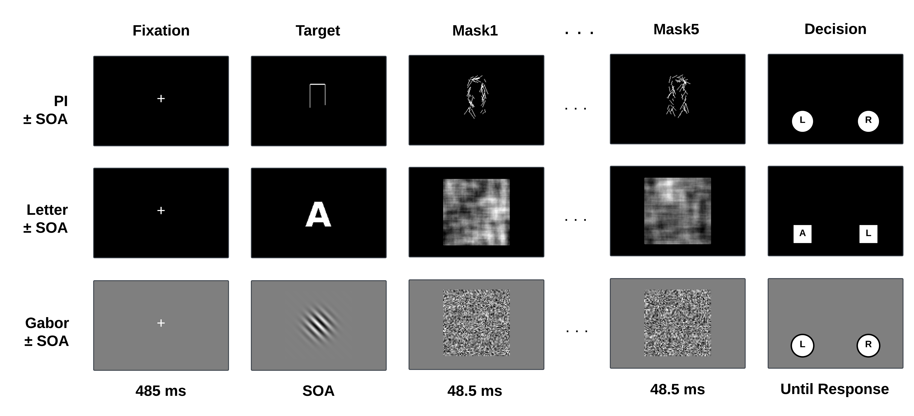
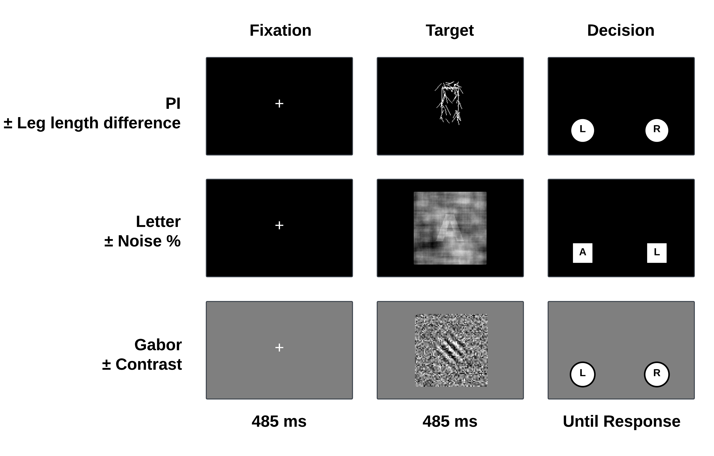
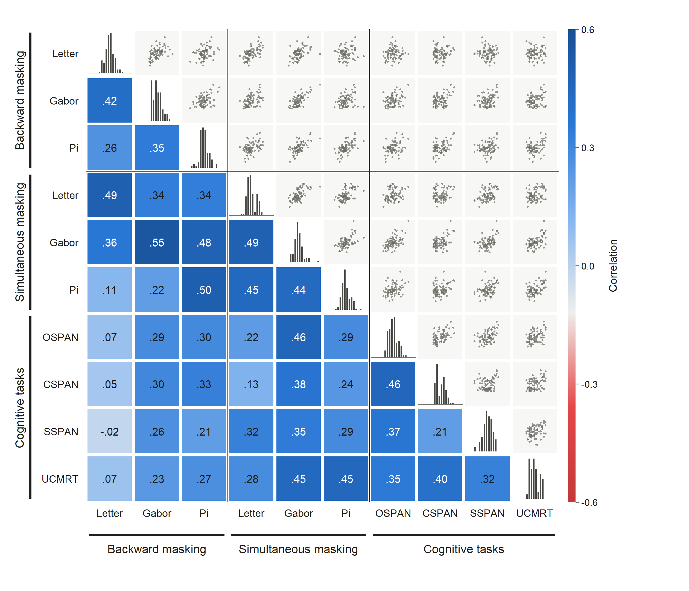
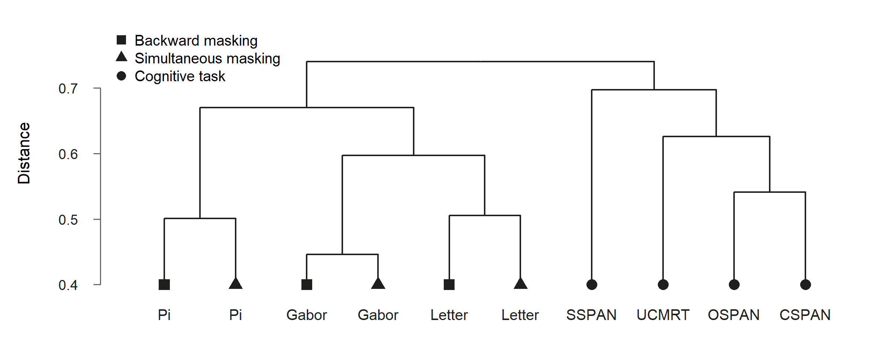
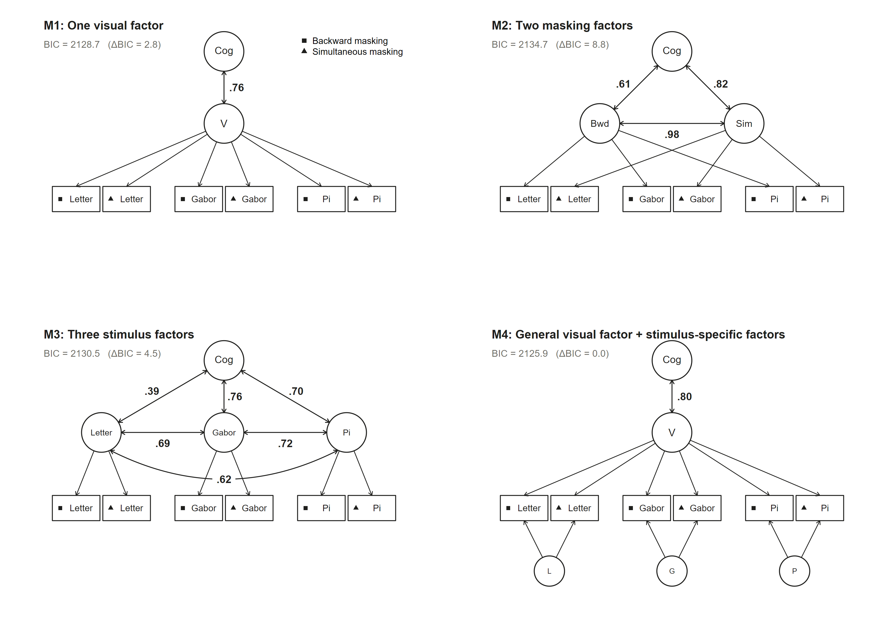

```{r}
knitr::opts_chunk$set(
  echo = FALSE, 
  message=FALSE, 
  warning = FALSE)
```

```{r backward, echo = FALSE, fig.cap = "Backward visual masking tasks.", out.width = "100%"}

```

```{r simultaneous, echo = FALSE, fig.cap = "Simultaneous visual masking tasks.", out.width = "100%"}

```

```{r corr, echo = FALSE, fig.cap = "corr plot", out.width = "100%"}

```

```{r hcluster, echo = FALSE, fig.cap = "hcluster", out.width = "100%"}

```

```{r fit, echo = FALSE, fig.cap = "model fit", out.width = "100%"}

```
# Introduction
Understanding how fundamental perceptual abilities interrelate and contribute to cognitive performance is one of the central topics in cognitive psychology and individual-differences research. Perhaps the best-known finding in this literature concerns inspection time (IT), the minimum exposure duration at which an observer can reliably make a simple perceptual discrimination. @Vickers.etal.1972a first introduced this paradigm. In its classic form, participants briefly view a stimulus consisting of two vertical lines of clearly unequal length joined at the top (hereafter, the Pi stimulus) and indicate which line is longer. By varying the exposure duration of the Pi stimulus and using a backward mask to prevent further visual processing, the minimum exposure duration required for accurate discrimination can be estimated. @Nettelbeck.Lally.1976a subsequently reported that IT correlated negatively with Performance IQ. This negative relation has since been replicated many times across age groups, sensory modalities, and measures of intelligence [@Deary.etal.1989; @Deary.Stough.1996; @Osmon.Jackson.2002]. Meta-analyses place the uncorrected correlation between IT and intelligence at about -.3, rising to about -.5 after correction for measurement error and range restriction [@Grudnik.Kranzler.2001; @Kranzler.Jensen.1989a]. The standard interpretation of this association is in terms of *processing speed*. Because the mask interrupts further processing of the target, performance depends on how much target information the observer can extract before the mask arrives; individuals who process information faster therefore require shorter exposures to discriminate the stimulus accurately [@Vickers.Smith.1986a]. Faster information processing, in turn, may benefit cognitive performance across a wide range of tasks [@Vernon.1983], resulting in negative correlations between IT and cognitive performance.

*Backward masking* is therefore a key manipulation for limiting how much target information can be extracted. As the interval between target onset and mask onset shortens, only observers who process information quickly can extract enough information from the target before the mask disrupts further processing. The situation changes, however, when target and mask are presented at the same time and remain on the screen for a sufficient duration. The target is then embedded in the mask rather than interrupted by it, a procedure known as *simultaneous masking*. In simultaneous masking, processing time is no longer the limiting factor; performance instead depends on how precisely the relevant features of the target can be extracted from the concurrent noise. This taps the same sensory discrimination ability assessed by classic sensory discrimination tasks, in which observers judge which of two stimuli is higher in pitch or longer in length [@Deary.etal.2004; @Deary.1994]. In both cases, performance is limited by how precisely the signal is represented relative to noise, whether that noise is added to the display or arises within the sensory system [@Pelli.Farell.1999]. We therefore treat simultaneous masking as a measure of sensory discrimination and use this term throughout the remainder of the paper.

Sensory discrimination, like processing speed, has long been linked to cognitive performance. @Galton.1883 proposed that finer sensory acuity supplies the raw material for intelligent judgment, and @Spearman.1904 found that discrimination of pitch, light, and weight loaded on a general factor of intelligence, which he termed *g*. Subsequent studies have reported reliable correlations between single discrimination tasks and intelligence.[@Raz.etal.1987;@Mosing.etal.2014;@Mikellidou.etal.2023]. @Deary.etal.2004 reported a latent correlation of .92 between general discrimination and general intelligence

Although both processing speed and sensory discrimination have shown reliable correlations with cognitive performance, few studies have measured them in the same participants, and none, to our knowledge, has done so with the same stimuli and masks. The closest precedent is @Tsukahara.etal.2020, which measured both constructs in the same participants. However, their sensory discrimination tasks required auditory judgments of the pitch, loudness, or duration of tones, whereas their processing speed tasks required speeded comparisons of visually presented letter and digit strings. When stimulus, sensory modality, and construct vary together, two alternative interpretations cannot be ruled out. First, individual differences may be partly stimulus-specific. Studies that administer batteries of visual tasks to the same observers typically find weak correlations among tasks [@Cappe.etal.2014;  @Tulver.2019], so an observer may perform well with one type of stimulus but poorly with another. An apparent dissociation between processing speed and sensory discrimination may then reflect differences between the materials rather than between the processes. Second, the variance that the two kinds of tasks share may reflect a general perceptual factor rather than two distinct abilities [@Deary.1994a], in which case the distinction between sensory discrimination and processing speed would not hold at the level of individual differences. In the present study, we addressed both possibilities by holding the stimulus constant while varying only the masking procedure. We used three stimulus types, a Gabor patch, a letter, and the Pi stimulus, and each was presented with an identical mask under both backward masking and simultaneous masking. This fully crossed 2 (masking procedure) × 3 (stimulus type) design follows the logic of the multitrait–multimethod matrix [@Campbell.Fiske.1959a]: because every stimulus appears under both masking procedures, variance associated with the masking procedure can be separated from variance associated with the stimulus. If sensory discrimination and processing speed are distinct abilities, tasks that share a masking procedure should correlate more strongly than tasks that share a stimulus; if individual differences are instead organized by stimulus content, the reverse should hold.

Participants also completed three complex span tasks of working memory [@Conway.etal.2005; @Unsworth.etal.2005; @Pahor.etal.2022a] and a matrix reasoning test of fluid intelligence [@Pahor.etal.2019], which together served as our measures of cognitive performance. This allowed us to ask, in addition, whether sensory discrimination and processing speed share their relation to cognitive performance, and whether that relation depends on stimulus content. 


# Task description

To assess the sensory discrimination ability and processing speed, the experiment contained six visual masking tasks: three employing backward masking (Figure \@ref(fig:backward)) and three employing simultaneous masking (Figure \@ref(fig:simultaneous)). Both sets of tasks used the same stimulus classes (a Gabor stimulus, a letter stimulus, and a Pi stimulus) and mask classes. The critical difference was the masking procedure: in the backward masking tasks, the mask followed the stimulus after a variable stimulus–onset asynchrony (SOA), whereas in the simultaneous masking the stimulus and mask were presented simultaneously. 

To assess cognitive performance, participants completed three complex span tasks of working memory (OSPAN, CSPAN, and SSPAN) and one matrix reasoning test of fluid intelligence (UCMRT). Because working memory capacity and fluid intelligence are strongly related constructs [@Kane.etal.2005], and because our main goal was to examine how sensory discrimination and processing speed relate to cognitive performance as a whole rather than to its specific components, we treated the four tasks as joint indicators of a single construct, which we refer to as *cognitive performance*.

## Sensory discrimination tasks

**Gabor.**$\quad$Participants completed a two-alternative forced-choice orientation discrimination task. On each trial, a fixation cross was presented for 485 ms, followed by a centrally presented, random-phase Gabor patch (±45° orientation) embedded in white noise, which remained on the screen for another 485 ms. Participants indicated whether the grating was tilted up-left or up-right by pressing the keyboard. Task difficulty was adaptively adjusted by varying stimulus contrast.

**Letter.**$\quad$Participants performed a forced-choice letter identification task using the keys A–L (second keyboard row). Each trial began with a 485 ms fixation cross, followed by a centrally presented target letter (one of A, S, D, F, G, H, J, K, L) displayed for  485 ms. The letter was embedded in a frequency-matched letter noise mask constructed as follows: We constructed the mask by first computing the pixelwise average of the nine possible letters and then perturbing its Fourier spectrum with complex Gaussian noise. After inverse transformation and normalization, this yielded a structured noise pattern with the same overall spatial frequency profile as the average letter image. On each trial, the target letter was linearly blended with this mask (blend coefficient $\alpha$), and participants identified the letter using the corresponding keyboard key. Task difficulty was adaptively adjusted by varying $\alpha$.

**Pi.**$\quad$Participants performed a forced-choice judgment on a $\Pi$-shaped (Pi) target, indicating which vertical “leg” was longer (left vs. right). Each trial began with a 485 ms fixation cross, followed by a centrally presented $\Pi$ stimulus for  485 ms. The mask was composed of random oblique line segments arranged to form a $\Pi$-like clutter. Short line elements (randomized in length and orientation within ±10°–45°) were placed in two vertical columns aligned with the legs of the $\Pi$ and around the crossbar region. Equal numbers of lines were drawn on each side, although their random placement could introduce local asymmetries. On each trial, the target $\Pi$ was superimposed on this cluttered mask, and participants indicated which leg appeared longer using the keyboard. Task difficulty was adaptively controlled by varying the leg-length difference ($\Delta L$).

## Processing Speed Tasks

**Gabor.**$\quad$The task matched the simultaneous Gabor-orientation discrimination task. Each trial began with a 485 ms fixation cross, followed by a centrally presented, random-phase Gabor patch (±45° orientation). After a variable SOA, the target was replaced by a dynamic sequence of five white noise masks (48 ms each). Participants indicated whether the grating was tilted up-left or up-right by pressing the keyboard. Task difficulty was adaptively adjusted by SOA.

**Letter.**$\quad$The task matched the simultaneous letter-identification condition. Each trial began with a 485 ms fixation cross, followed by a centrally presented target letter (one of A, S, D, F, G, H, J, K, L). After a variable SOA, the target was replaced by a dynamic sequence of five frequency-matched letter noise masks (48 ms each). Participants identified the letter using the corresponding keyboard key. Task difficulty was adaptively adjusted by varying SOA.

**Pi.**$\quad$The task matched thesimultaneous $\Pi$-leg discrimination condition. Each trial began with a 485 ms fixation cross, followed by a centrally presented $\Pi$ stimulus. After a variable SOA, the target was replaced by a dynamic sequence of five clutter masks composed of randomly oriented oblique line segments (48 ms each). Participants indicated which leg appeared longer using the keyboard. Task difficulty was adaptively controlled by varying SOA.

## Cognitive tasks

**OSPAN.**$\quad$Participants completed an automated OSPAN task [@Unsworth.etal.2005] combining simple math operations with working memory recall for letter sequence. Each set contained 3–7 letters, with each set size presented three times, yielding 15 memory sets in total. Before the main task, participants completed three practice sets of size three to familiarize themselves with the procedure. In the main task, set sizes 3–7 were each presented three times in randomized order (15 sets total). Within each set, trials alternated between (i) a math operation screen (e.g., “6 + 2 = ?”), after which the participant clicked to continue, and (ii) a proposed answer screen showing a single digit; participants judged whether the digit correctly solved the operation by clicking true/false. A single uppercase letter was then shown for 800 ms, and the sequence continued until the set ended. At recall, participants clicked the letters in serial order from a matrix. For each set, participants earned points equal to the set size only if (a) all math operations are solved less than their average solving time in practice trials plus 2.5 SD, (b) no math errors occurred for that set, and (c) all letters were recalled in the correct order. Sets failing either criterion scored 0. The final OSPAN score was the sum of points across all sets.

**CSPAN.**$\quad$Participants completed a CSPAN task [@Conway.etal.2005] combining serial counting with working memory recall for number sequence. Each display contained a set of target items (green circles) intermixed with distractors (yellow circles). Participants counted the number of targets in each display, after which the participant clicked to continue to the next display. At recall, participants were prompted to recall the sequence of counts (e.g., “3–5–2”) in the exact order they were encountered. Responses were made by clicking the digits from a matrix. The procedure began with three practice sets of size 2. The main task then presented set sizes 3–7, each three times in randomized order (15 sets total). A set contributed points equal to its size only if the final recall sequence was accurate in both values and order. The final CSPAN score was the sum of points across all sets.

**SSPAN**$\quad$Participants completed a SSPAN task adapted from the Corsi block-tapping paradigm to assess both storage and processing aspects of spatial working memory [@Pahor.etal.2022a]. On each trial, cartoon gophers appeared sequentially in one of 12 possible screen locations, each presented for 1,500 ms with a 500 ms inter-stimulus interval. Participants were required to reproduce the sequence by tapping the corresponding locations in the exact order. Between each gopher presentation participants performed a secondary sorting task, dragging an item to the left or right, thereby imposing concurrent processing demands and limiting reliance on mnemonic strategies. Sequence length ranged adaptively from 2 to 10 items, increasing or decreasing in difficulty depending on accuracy.  The final SSPAN score was the total successfully recalled items across all sets.

**UCMRT**.$\quad$Participants completed the UCMRT [@Pahor.etal.2019], a measure of fluid intelligence modeled  after Raven’s Progressive Matrices. Each trial presented a 3×3 matrix of abstract visual patterns with the bottom-right cell missing, and participants selected the option that best completed the matrix from eight alternatives displayed below. UCMRT was chosen because it was especially developed for young adults with above-average performance on matrix reasoning tasks, providing a more sensitive and efficient assessment of individual differences in fluid intelligence in this population. The task consisted of 23 problems of varying difficulty, including 2 two-relation items, 3 three-relation items with a single transformation, 6 three-relation items with two transformations, 6 three-relation items with three transformations, and 6 logic items. Performance was scored as accuracy, defined by the number of correctly solved matrices. 

# Method

## Apparatus

Participants were tested individually in a dimly lit cubicle, seated approximately 100 cm from a 24-inch BenQ LED gaming monitor (1920 × 1080 pixels, 165 Hz refresh rate, 6.06 ms per frame). Stimuli were generated with PsychoPy3 [@Peirce.etal.2019] in Python 3.8, running on a PC with Lubuntu Linux 22.04. The background was a uniform mid-gray with a luminance of approximately 100 cd/m².

## Participants

Eighty-three undergraduate students at the University of California, Irvine, participated in exchange for $50 in total compensation. Four participants withdrew before completing all sessions, leaving a final sample of 79. All participants reported normal or corrected-to-normal vision and provided informed consent. The study was approved by the Institutional Review Board of the University of California, Irvine (Study ID: STUDY00000064).

## Procedure

The experiment consisted of three sessions of approximately one hour each, conducted on separate days within one week. Each session comprised three blocks, with short breaks permitted between blocks. The first and third blocks were visual masking blocks, and the middle block contained the cognitive tasks for that session: OSPAN on the first day, CSPAN on the second day, SSPAN task and the UCMRT on the third day.

Within each visual masking block, participants completed all six visual masking tasks in random order. Each task consisted of 50 trials, on which a two-down–one-up and a three-down–one-up staircase strictly alternated, yielding 25 trials per staircase. Because the two staircases converge on different performance levels, approximately 70.7% and 79.4% correct, respectively [@Levitt.1971], alternating them allowed the psychometric function to be estimated more precisely.In total, each participant completed 300 trials per task (6 blocks × 50 trials). The first masking block served as practice and was excluded from analysis, leaving 250 trials per task (125 per staircase) and 1,500 masking trials per participant for analysis.

## Data Exclusion

Data were screened separately for each participant and each masking task. A participant's data on a given task were excluded from further analysis if either of two criteria was met. First, the participant's raw threshold, computed as the mean stimulus level across the 250 analyzed trials, deviated by more than four standard deviations from the group mean threshold for that task. Second, the observed accuracy on either staircase deviated by more than 5 percentage points from its target accuracy (70.7% for the two-down–one-up staircase and 79.4% for the three-down–one-up staircase), indicating that the staircase had not converged as intended. In total, 14 task datasets from 10 participants were excluded. These participants' remaining tasks were retained in the analysis.

# Random-effect psychophysics model

Individual thresholds on the perceptual tasks and the correlations among them were estimated with a hierarchical psychometric model [@Rouder.Mehrvarz.2026]. The model estimates individual thresholds and their correlations simultaneously from trial-level data, thereby accounting for trial-to-trial noise and avoiding the attenuation of correlations caused by measurement error.

At the data level, let $y_{ijk}$ denote the binary correctness outcome on the $k$-th trial of participant $i$ in task $j$. We assume
$$
y_{ijk} \sim \text{Bernoulli}\!\left(F(s_{ijk}; \theta_{ij}, \beta_{j})\right),
$$

where the success probability is given by a task-specific psychometric function, modeled as a cumulative normal function of log stimulus strength with a lower asymptote at chance:

$$
F(s_{ijk}; \theta_{ij}, \beta_{j}) = \gamma_j + (1-\gamma_j)\,\Phi\!\left(\beta_j\,(s_{ijk}-\theta_{ij})\right).
$$

Here, $\Phi(\cdot)$ denotes the standard normal cumulative distribution function, and $\gamma_j$ is the guessing rate for task $j$, fixed at .5 for the two-alternative Gabor and Pi tasks and at 1/9 for the nine-alternative letter tasks. The variable $s_{ijk}$ denotes the log-transformed stimulus strength on trial $k$ for participant $i$ on task $j$. In the backward masking tasks, stimulus strength was the SOA; in the simultaneous masking tasks, it was the Gabor contrast, the target weight $\alpha$ in the letter–noise blend, and the leg-length difference $\Delta L$ of the Pi stimulus, respectively. The parameter $\theta_{ij}$ denotes the latent threshold of participant $i$ on task $j$, expressed on the same log scale as $s_{ijk}$, and $\beta_j$ denotes the slope of the psychometric function for task $j$.

At the latent level, each participant is characterized by a vector of ten person-level parameters: the six latent thresholds from the masking tasks and the standardized scores on the four cognitive tasks,

$$
\boldsymbol{\theta}_i = \left(\theta_{i1}, \ldots, \theta_{i6}, c_{i1}, \ldots, c_{i4}\right)^\top,
$$

where $c_{im}$ denotes the standardized score of participant $i$ on cognitive task $m$. These ten parameters are assumed to follow a multivariate normal distribution,

$$
\boldsymbol{\theta}_i \sim \mathcal{N}_{10}\!\left(\boldsymbol{\mu}, \boldsymbol{\Sigma}\right),
$$

where $\boldsymbol{\mu}$ captures the mean of each task and $\boldsymbol{\Sigma}$ captures the covariance among tasks. The covariance matrix is given a scaled inverse-Wishart (SIW) prior [@Huang.Wand.2013a] which is robust to differences in the measurement scales of the tasks and is computationally efficient to estimate [@Yang.Rouder.2026]. Full details of the model specification are provided in Appendix A.

The model was implemented in Stan [@Carpenter.etal.2017]. We ran 4 chains, each with 2,000 warmup steps followed by 3,000 tuning steps. Convergence was assessed with the rank-normalized $\hat{R}$ statistic [@Vehtari.etal.2021], which was below 1.01 for all parameters.

# Result

Figure \@ref(fig:corr) summarizes the model-estimated scores for the six masking tasks and the four cognitive tasks. Because the scales of tasks are different, all scores were standardized before plotting. The distributions on the diagonal were unimodal and roughly symmetric, with substantial spread across participants. Thus, all ten tasks captured meaningful individual differences. The lower triangle of Figure \@ref(fig:hcluster) shows the model-based correlations among the ten tasks. With a single exception between backward letter task and SSPAN(*r* = -.02), all 45 correlations were positive. The mean correlation was .39 among the six masking tasks and .35 among the four cognitive tasks. The mean correlation between the masking tasks and the cognitive tasks was lower at .26, in part because the backward letter task was nearly unrelated to all four cognitive tasks. We will return to this task in the Discussion.

It is worth noting that the three same-stimulus pairs, in which the same stimulus was tested under backward and simultaneous masking, showed the three highest correlations among the masking tasks (mean *r* = .52). By comparison, the mean correlation was .40 between tasks that shared a masking procedure but differed in stimulus, and .31 between tasks that differed in both. This pattern suggests that stimulus content plays a substantial role in individual differences in masking tasks performance. More direct evidence comes from hierarchical clustering, an unsupervised method that groups tasks according to their similarity without imposing any a priori structure (Figure \@ref(fig:summary)B). The first three merges each joined the two masking procedures of the same stimulus, only after these pairs had formed did they combine with one another. By comparison, the three backward masking tasks or the three simultaneous masking tasks fail to form a cluster of their own. The four cognitive tasks formed a separate cluster, which joined the masking tasks only at the final step (distance = .74). Thus, individual differences in masking performance were organized primarily by stimulus rather than by masking procedure.

\newpage


# Reference